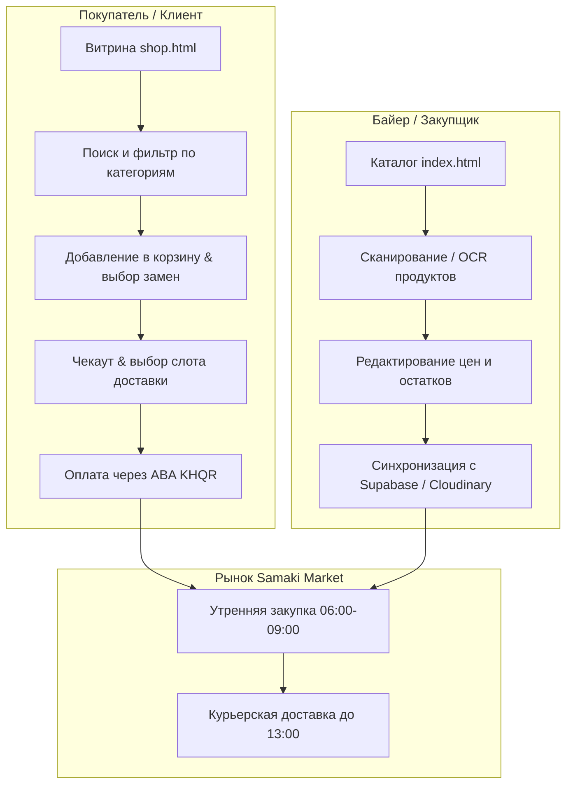

# FreshMarket — Концепция продукта и архитектура (Product Concept)

> **FreshMarket** — прогрессивное веб-приложение (PWA) для утренней закупки и доставки свежих фермерских продуктов с рынка **Samaki Market** (г. Кампот, Камбоджа).

---

## 1. Миссия и бизнес-модель

### Проблема:
* Закупка свежих сезонных продуктов на традиционном кхмерском рынке сопряжена с языковым барьером (кхмерский / английский / русский), необходимостью раннего подъема (утренний базар 06:00–10:00) и отсутствием прозрачного онлайн-каталога с актуальными ценами.
* Экспаты и местные жители ценят свежесть локальных фруктов, зелени и морепродуктов, но нуждаются в удобном сервисе предварительного заказа с доставкой до двери.

### Решение FreshMarket:
* **Каталог номенклатуры (Nomenclator / Admin PWA):** инструмент для байера / закупщика с офлайн-словарем, распознаванием этикеток и ценников через Gemini Vision AI, поддержкой кхмерских названий и синхронизацией с облачными хранилищами (Supabase Storage / Cloudinary).
* **Клиентская витрина (Customer Storefront PWA):** мобильный интерфейс для покупателей с выбором слотов доставки, правилами автозамен (Replacement Options), корзиной и моментальной оплатой через **ABA KHQR**.
* **Единая дизайн-система (`css/components.css`):** единый UI Kit в стиле Apple Titanium Dark / Cupertino Light с плавающей островной навигацией (Floating Island Dock), поддержкой жестов (Swipe Actions) и шторками Bottom Sheet.

---

## 2. Роли и сценарии пользователей



---

## 3. Технологический стек и архитектура

| Уровень | Технология | Назначение |
| :--- | :--- | :--- |
| **Frontend Core** | Vanilla JavaScript (ES6+ Classes), HTML5 | Высокая производительность без тяжелых фреймворков |
| **Стилизация** | Vanilla CSS3, CSS Custom Properties | Дизайн-система `css/components.css`, модульные `products.css` и `shop.css` |
| **PWA & Offline** | Service Worker, Web App Manifests | Установка на домашний экран iOS/Android, офлайн-словарь |
| **AI & Vision** | Google Gemini Vision API | Автоматическое распознавание продуктов и автозаполнение по фото |
| **Облачное хранилище** | Supabase Storage (S3 API) / Cloudinary | Хранение оптимизированных фотографий продуктов |
| **Платежи** | ABA PayWay / KHQR Standard (National Bank of Cambodia) | Мгновенные переводы в USD и KHR |

---

## 4. Структура проекта

```
FreshMarket/
├── components.html        # UI Kit & Workbench дизайн-системы
├── index.html             # Каталог номенклатуры и рабочее место байера
├── shop.html              # Клиентская витрина магазина для покупателей
├── css/
│   ├── components.css     # Единый мастер-файл стилей компонентов (Single Source of Truth)
│   ├── products.css       # Специфичные стили каталога (сканер, аккордеон, свайпы)
│   └── shop.css           # Специфичные стили магазина (корзина, чекаут, KHQR)
├── js/
│   ├── app.js             # Логика каталога, OCR, управление базой
│   └── shop.js            # Логика витрины, корзины и заказов
├── data/
│   ├── products_dictionary.json # Офлайн-словарь камбоджийских продуктов
│   └── CATEGORIES.md      # Справочник продуктов Samaki Market (EN/KH/RU)
├── assets/
│   ├── icon-192.svg       # PWA-иконка 192x192
│   └── icon-512.svg       # PWA-иконка 512x512
├── manifest.json          # Манифест каталога
├── manifest-shop.json     # Манифест магазина
├── sw.js                  # Service Worker
├── CONCEPT.md             # Концепция продукта
├── ROADMAP.md             # Дорожная карта развития
└── AGENTS.md              # Правила для AI-ассистента
```

---

## 5. Модель данных продукта

```json
{
  "id": "prod_mango_keo_romeat",
  "name_en": "Keo Romeat Mango",
  "name_kh": "ស្វាយកែវរមៀត",
  "name_ru": "Манго Кео Ромиет (желтое)",
  "category": "fruits",
  "unit": "kg",
  "price_usd": 2.50,
  "photo_url": "https://.../mango.webp",
  "description": "Сладкое спелое камбоджийское манго высшего сорта с тонкой кожицей.",
  "in_stock": true,
  "seasonality": "year-round",
  "origin": "Kampot Farm"
}
```
